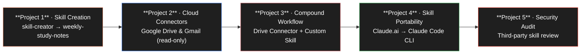
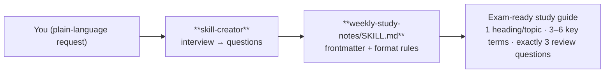
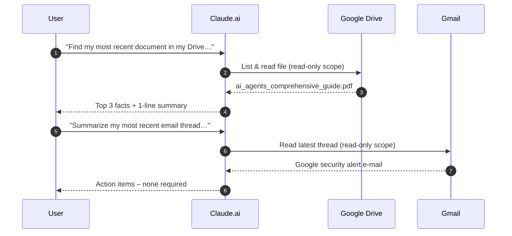
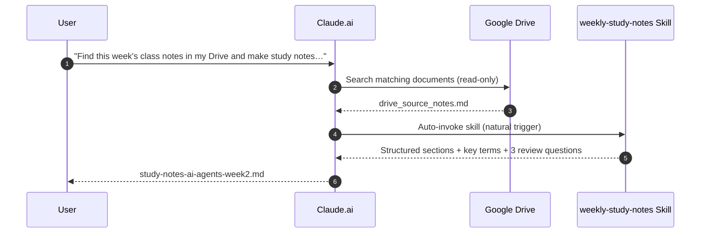
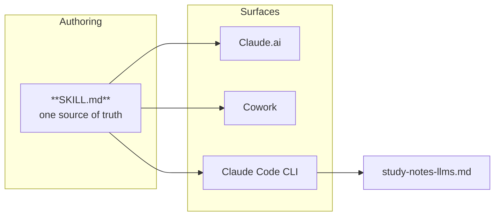
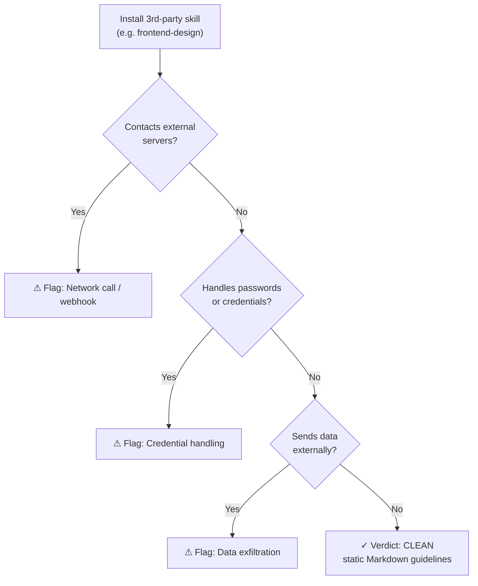

<div align="center">

# Claude Skills & Connectors — Practical Mastery

**Hands-on projects (1–5) covering Skill creation, Cloud Connectors, compound workflows, portability, and security auditing across Claude.ai and Claude Code.**


</div>

---

## What This Repository Is

A production-grade, hands-on walkthrough showing the full lifecycle of **Claude Skills** and **Cloud Connectors** — from teaching AI your personal formatting preferences, to connecting live personal data (Google Drive & Gmail), to running compound multi-surface workflows, and finally to auditing third-party skills for security.



Each project is self-contained (own README, inputs, outputs, and skill files) so you can study them in any order.

---

## Repository Structure

```text
Skills_and_Connectors_Projects/
├── README.md                                  # Root master guide (this file)
├── .claude/                                   # Root Claude configuration & skills
│   └── skills/
│       ├── weekly-study-notes/
│       └── frontend-design/
│
├── project-01/                                # Building a custom skill with skill-creator
│   ├── .claude/skills/weekly-study-notes/
│   ├── inputs/raw_class_notes.txt
│   ├── outputs/study-notes-ai-agents.md
│   └── README.md
│
├── project-02/                                # Connecting Google Drive & Gmail (read-only)
│   ├── .claude/connectors-config.md
│   ├── inputs/ai_agents_comprehensive_guide.pdf
│   ├── outputs/ai_agents_guide_summary.md
│   ├── outputs/email_thread_summary.md
│   └── README.md
│
├── project-03/                                # Compounding: Drive Connector + Custom Skill
│   ├── .claude/skills/weekly-study-notes/
│   ├── inputs/drive_source_notes.md
│   ├── outputs/study-notes-ai-agents-week2.md
│   └── README.md
│
├── project-04/                                # Skill portability: Claude.ai -> Claude Code CLI
│   ├── .claude/skills/weekly-study-notes/
│   ├── inputs/raw_llm_notes.txt
│   ├── outputs/study-notes-llms.md
│   └── README.md
│
└── project-05/                                # Auditing 3rd-party community skills
    ├── .claude/skills/frontend-design/
    ├── outputs/frontend-design-review.md
    └── README.md
```

---

## Projects at a Glance

| Project | Focus / Technique | Primary Prompt / Trigger | Deliverable |
| :--- | :--- | :--- | :--- |
| [**Project 1**](./project-01/README.md) | **Skill Creation** (`skill-creator`) | *"Use the skill-creator skill to build me a weekly study-notes skill..."* | [`study-notes-ai-agents.md`](./project-01/outputs/study-notes-ai-agents.md) |
| [**Project 2**](./project-02/README.md) | **Cloud Connectors** (Drive & Gmail) | *"Find my most recent document in my Drive..."* / *"Summarize my most recent email thread..."* | [`ai_agents_guide_summary.md`](./project-02/outputs/ai_agents_guide_summary.md)<br>[`email_thread_summary.md`](./project-02/outputs/email_thread_summary.md) |
| [**Project 3**](./project-03/README.md) | **Compound Workflow** (Skill + Connector) | *"Find this week's class notes in my Drive and make study notes from them."* | [`study-notes-ai-agents-week2.md`](./project-03/outputs/study-notes-ai-agents-week2.md) |
| [**Project 4**](./project-04/README.md) | **Skill Portability** (Claude Code CLI) | *"Use this skill to make study notes from..."* | [`study-notes-llms.md`](./project-04/outputs/study-notes-llms.md) |
| [**Project 5**](./project-05/README.md) | **Security Audit** (3rd-Party Skills) | *"Read the skill I just installed and tell me, in plain language, exactly what it instructs you to do..."* | [`frontend-design-review.md`](./project-05/outputs/frontend-design-review.md) |

---

## Detailed Project Descriptions

### Project 1 — Weekly Study-Notes Skill Creation

**Goal:** Teach Claude your exact study-note formatting preferences once so you never have to re-explain them.



**Workflow:**
1. Trigger Claude's `skill-creator` to interview you on desired structure.
2. Generates `weekly-study-notes/SKILL.md` with strict rules: one heading per topic, 3–6 bold key terms, and exactly 3 review questions at the end.
3. Calibrate triggering behavior by testing: *"When would you use this skill, and when would you NOT use it?"*
4. Test by pasting raw lecture notes on **AI Agents** without referencing the skill name.

> **Key Takeaway:** *"I taught AI how I do my weekly notes once, and now it does it in one sentence, every time."*

---

### Project 2 — Connectors (Google Drive & Gmail Integration)

**Goal:** Connect live accounts directly to Claude under the Principle of Least Privilege (**read-only**).



**Workflow:**
1. Authorize Google Drive and Gmail connectors in Claude.ai.
2. Query Google Drive for the most recent PDF document ([`ai_agents_comprehensive_guide.pdf`](./project-02/inputs/ai_agents_comprehensive_guide.pdf)) to extract the top 3 facts and a 1-line summary.
3. Query Gmail for recent security alerts, extract actionable items, and confirm read-only account safety.

> **Key Takeaway:** *"I asked one question and AI pulled the answer out of my own files; I never copied or pasted a thing."*

---

### Project 3 — Compound Workflow (Drive Connector + Custom Skill)

**Goal:** Combine connectors and skills to execute complex workflows in a single sentence.



**Workflow:**
1. Place lecture notes in Google Drive.
2. Run: *"Find this week's class notes in my Drive and make study notes from them."*
3. The Drive connector fetches the document, and the `weekly-study-notes` skill immediately formats it into an exam-ready study guide.

> **Key Takeaway:** *"I taught AI my monthly report once and pointed it at my files; now the whole thing runs from one sentence and I just review it."*

---

### Project 4 — Skill Portability (Claude Code CLI Integration)

**Goal:** Demonstrate that skills are an open, portable standard that travel between Claude.ai, Cowork, and Claude Code CLI.



**Workflow:**
1. Add `SKILL.md` to the local `.claude/skills/weekly-study-notes/` folder.
2. Launch Claude Code in the terminal.
3. Run the skill against raw notes covering **Large Language Models (LLMs)**, producing [`study-notes-llms.md`](./project-04/outputs/study-notes-llms.md).

> **Key Takeaway:** *"I handed my skill to a friend and it just worked, without me in the room."*

---

### Project 5 — Skill Security Audit & Review

**Goal:** Audit third-party community skills before allowing them to run in your workspace.



**Workflow:**
1. Download or install an external skill (e.g. `frontend-design`).
2. Run the security audit prompt requesting a plain-language summary and checks for network calls, credential handling, or data exfiltration.
3. Review the generated audit report verifying the skill is completely clean.

> **Key Takeaway:** *"I read a skill before trusting it, in plain English, without understanding a single line of code."*

---

## Skills in This Repository

| Skill | Location | Use When |
| :--- | :--- | :--- |
| `weekly-study-notes` | `.claude/skills/weekly-study-notes/` (root + Projects 1, 3, 4) | User wants raw class/lecture notes turned into exam-ready study guides |
| `frontend-design` | `.claude/skills/frontend-design/` (root + Project 5) | User wants design-forward, non-generic frontend code |

---

## How to Use This Repository

### 1. Cloning the Repo

```bash
git clone <your-repo-url>
cd Skills_and_Connectors_Projects
```

### 2. Using with Claude Code CLI

Claude Code automatically discovers skills in any `.claude/skills/` directory:

```bash
claude
```

You can invoke the study notes skill directly:

```text
Make study notes from: [paste your raw notes here]
```

### 3. Using with Claude.ai (Web UI)

1. Go to **Claude.ai → Customize → Skills**.
2. Create a new skill and copy-paste the contents of [`project-01/.claude/skills/weekly-study-notes/SKILL.md`](./project-01/.claude/skills/weekly-study-notes/SKILL.md).
3. Connect **Google Drive** or **Gmail** under **Integrations** to reproduce the connector workflows.